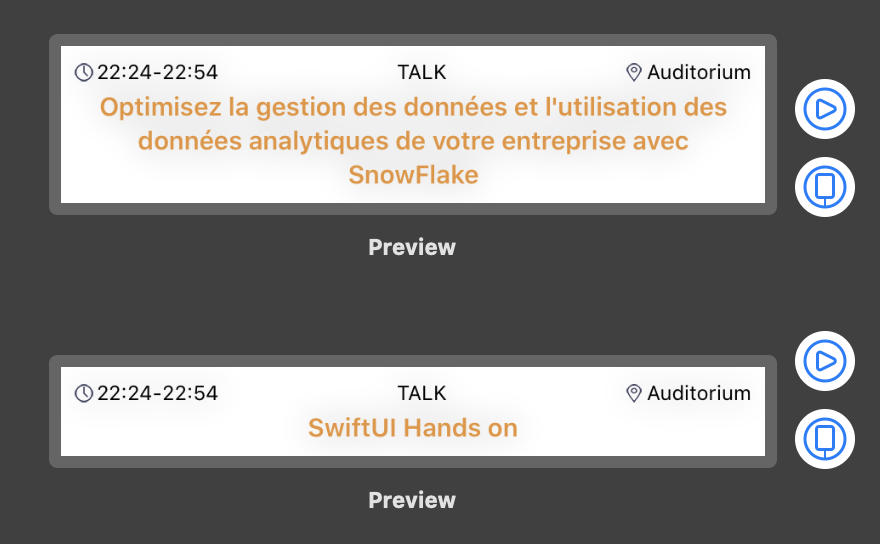

# HandsOn SwiftUI
SwiftUI, c'est le nouveau SDK pour développer des apps cross-plateform dans l'éco-système Apple.

Il adopte une approche déclarative déjà vu chez d'autres comme ReactJS ou VueJS.

Dans ce hands-on vous allez découvrir et prendre en main l'outil pour découvrir ce fonctionnement mais similitudes/différences avec les technlogies précédemment citées. Gardez en tête que, bien qu'en gestation depuis de nombreuses années (4 ans), l'outil n'est disponible que depuis quelques mois. Il est donc encore assez jeune :)

## Useful Shortcuts
* `Option-Cmd-Enter` - Toggle Live Preview
* `Option-Command-P` - Resume Live Preview
* `Command + Shift + L` - Quick Insert
* `Command + click on Code` - Open SwiftUI actions

## Exercice 1 - SwiftUI le premier contact

  > Le but de l'exercice est d'apprendre à créer une nouvelle `View` sur `Xcode`.

1. Créez un nouvelle `View` appelée `TalkRow` dans `Xcode`

Choisissez sur le menu en haut `File > New > File...` et `SwiftUI View` comme dans l'image pour créer le fichier.


&nbsp;

Vous remarquez que `TalkRow` implémente le protocole `View`. C'est le type "primitif" de SwiftUI : tous les éléments visuels sont de type `View`. La mise en forme d'une `View` se définit dans sa propriété `body` à base... de `View` !.

2. Passez un `Talk` en paramètre de `TalkRow` et remplacez le contenu de `Text` par le titre de `Talk`.
3. Mettez à jour la preview et vérifiez que votre titre s'affiche bien.
4. Remplissez notre `TalkRow` avec le type et la salle du `Talk` pour qu'il resemble à l'image suivante:


&nbsp;
&nbsp;

> Pour combiner plusieurs view, nous allons utiliser 3 stacks: HStack, VStack et ZStack.


## QUIZZ

1. Quand vous créez une `View`, où déclarez-vous le layout ?
2. Combien de root view `body` peut-il contenir ?
3. Comment fait-on pour passer des données à une `View` custom ?

# Exercice 2 - Composition
  > Vous allez découvrir comment composer vos propres `View`.

Le code de notre `View` commence à devenir gros et difficilement lisible. Il est de temps de séparer quelque peu les choses.

Créez un nouveau composant, `Time` pour afficher la date d'un slot. Le résultat doit ressembler à celui-ci :


Vous aurez besoin de mettre en forme la date, pour cela utilisez le code ci-dessous :
```swift
static private var formatter = { () -> DateFormatter in
    let formatter = DateFormatter()
    formatter.setLocalizedDateFormatFromTemplate("HH:mm")

    return formatter
}()
```

# Exercice 3 - Modifiers

2. Essayez ces differents modifiers:
* background
* font
* alignement
* ...

3. Utiliser des modifiers pour donner un style a votre `TalkRow`

4. Affichez 2 previews du composant `TalkRow`, 1 avec un titre long et un autre avec un titre court

Vous devriez afficher un resultat comme le suivant :


&nbsp;

# Exercice 4 - Faisons des listes !
  > Le but de l'exercice est d'apprendre à manipuler des listes avec SwiftUI.

1. Créez une nouvelle `View` appelée `TalkRowList`
2. Créez une liste, et ajoutez-y 2 `TalkRow` avec du contenu statique. Pensez à mettre à jour votre preview !

Ca marche, mais nous devons écrire du contenu en dur dans chacune de nos `Views`, pas très pratique... Heureusement, Xcode fournit un dossier `Preview Content` dans lequel vous pouvez mettre du contenu à destination... des previews ! On va donc s'en servir pour définir nos contenus à destination de nos previews.

3. Créez un fichier `TalkPreview` dans `Preview Content`. Définissez-y un enum `TalkPreview` dans lequel vous déclarerez deux contenus statiques :
  - un `Talk` appelé `longTitle` avec le titre ""
  - un autre `rex` avec le titre "" et de type `.rex`
2. Remplacez vos contenus statiques dans `TalkRow` et `TalkRowList` par ces nouvelles références.

3. Passez les talks comme paramètres de TalkListView

4. Ajoutez un background à la liste

# Exercice 5 - Navigation
  > Le but de l'exercice est d'utiliser la navigation pour afficher une nouvelle vue.

Dans SwiftUI, la navigation se fait grâce à deux classes :
- `NavigationView`, pour la hiérarchie des vues
- `NavigationLink`, pour effectuer la navigation

1. Wrappez la liste dans un NavigationView.
2. Faites en sorte qu'au tap sur une row, l'utilisateur soit redirigé vers `TalkDetail`.

  > Vous pouvez tester la navigation depuis la Preview. Il faut juste rentrer en mode *Live Preview* (voir image ci-dessous). Le fond devient alors bleu/gris au lieu de blanc pour vous l'indiquer.

  

# Exercice 6 - Stateful
  > Le but de l'exercice est de découvrir comment gérer un état avec SwiftUI

Maintenant que nous pouvons naviguer, nous allons ajouter la possibilité de noter un talk.

1. Dans `TalkDetail`, ajoutez un nouvel attribut `rating: Rating?`, et passez le à la vue de notation pour qu'elle le mette à jour. Normalement, vous aurez un message d'erreur "'self' is immutable".

Pour pouvoir "modifier" `TalkDetail` et, surtout, tracker sa valeur au fil du temps, SwiftUI utilise la programmation réactive. Grâce aux *Property Wrappers* c'est assez simple à utiliser.

2. Ajoutez `@state` devant rating. Magie, ça compile et vous pouvez tester la notation depuis le *Live Preview*.
Testez depuis `TalkRowList`. Ca fonctionne, mais la notation n'est pas gardée entre chaque aller-retour !

> `@state` c'est quoi ? C'est un *Property Wrapper*, une struct qui va venir wrapper notre attribut et nous fournir des fonctionnalités/patterns. A la compilation, vous allez avoir 3 attributs auxquelles vous allez pouvoir accéder :
- `_rating`, le wrapper en lui-même, le "storage". Ici `state<Int?>`
- `rating`, la valeur. Juste des getter/setter qui vont aller piocher dans `_rating`.
- `$rating`, une valeur "projetée" fournit par notre wrapper. Ici `Binding<Int?>`.

> C'est grâce à `Binding` que SwiftUI va, en interne, tracker et mettre à jour l'état de notre vue.

Il nous faut modifier `talk` directment afin de gader sa notation à jour.

4. Retirez l'attribut `rating`, et utilisez `talk.rating` à la place. Ajoutez `@Binding` à `talk`.
4. Il faut maintenant pouvoir mettre à jour les talks dans `TalkDetail`. On a déjà vu un property wrapper qui permettait de faire ça, il vous suffit de l'ajouter à `talks`.
4. Il faut passer un `Binding<Talk>` à `TalkDetail`. Mettez à jour `ForEach` avec `ForEach(talks.indices)`, puis utilisez l'index pour récupérer :
* un `Talk` (pour `TalkRow`)
* un `Binding<Talk>` (pour `TalkDetail`)
