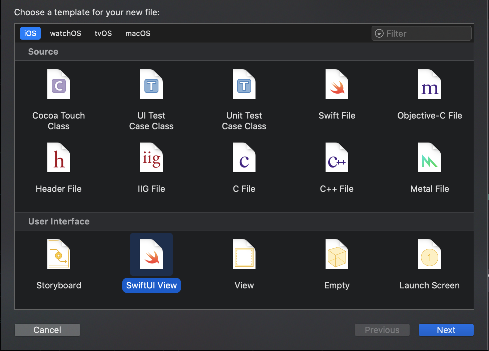

# HandsOn SwiftUI
SwiftUI, c'est le nouveau SDK pour développer des apps cross-plateform dans l'éco-système Apple.

Il adopte une approche déclarative déjà vu chez d'autres comme ReactJS ou VueJS.

Dans ce hands-on vous allez découvrir et prendre en main l'outil pour découvrir ce fonctionnement mais similitudes/différences avec les technlogies précédemment citées. Gardez en tête que, bien qu'en gestation depuis de nombreuses années (4 ans), l'outil n'est disponible que depuis quelques mois. Il est donc encore assez jeune :)

## Exercice 1 - SwiftUI le premier contact

  > Le but de l'exercice est d'apprendre à créer une nouvelle `View` sur `Xcode`.

1. Créez un nouvelle `View` appelée `TalkRow` dans `Xcode`

Choisissez sur le menu en haut `File > New > File...` et `SwiftUI View` comme dans l'image pour créer le fichier.


&nbsp;

Vous remarquez que `TalkRow` implémente le protocole `View`. C'est le type "primitif" de SwiftUI : tous les éléments visuels sont de type `View`. La mise en forme d'une `View` se définit dans sa propriété `body` à base... de `View` !.

  > On n'expliquera pas la notion de `some` dans hands-on. Pour les plus curieux, sachez juste qu'il s'agit d'un *Opaque type* et qu'un article paraîtra sur le blog à ce sujet ;)

Vous remarquez que `TalkRow` implémente le protocole `View`. C'est le type "primitif" de SwiftUI : tous les éléments visuels sont de type `View`. La mise en forme d'une `View` se définit dans sa propriété `body` à base... de `View` !.

  > On n'expliquera pas la notion de `some` dans hands-on. Pour les plus curieux, sachez juste qu'il s'agit d'un *Opaque type* et qu'un article paraîtra sur le blog à ce sujet ;)

2. Passez un `Talk` en paramètre de `TalkRow` et remplacez le contenu de `Text` par le titre de `Talk`.
3. Mettez à jour la preview et vérifiez que votre titre s'affiche bien.
  > Le canvas n'est pas affiché ? Pas de panique ! Appuyez sur Alt+Cmd+Enter pour l'ouvrir/fermer (même si ma mère me dit surtout de la fermer).

4. Remplissez notre `TalkRow` avec le reste des informations du `Talk` pour qu'il resemble à l'image suivante:


&nbsp;


## QUIZZ

1. Quand vous créez une `View`, où déclarez-vous le layout ?
2. Combien de root view `body` peut-il contenir ?
3. Comment fait-on pour passer des données à une `View` custom ?

# Exercice 2 - Styling
  > Vous allez découvrir comment manipuler une `View`.

5. Créez un autre composant pour afficher les dates d'un slot , utilisez ce formatter:
```swift
static private var formatter = { () -> DateFormatter in
    let formatter = DateFormatter()
    formatter.setLocalizedDateFormatFromTemplate("HH:mm")

    return formatter
}()
```
pour qu'il resemble à l'image suivante:

&nbsp;

6. Essayez ces differents modifiers:
* background

## 7. Utiliser les modifiers

## 8. 2 PREVIEW = 1 titre court et 1 titre long

# Exercice 3 - Faisons des listes !
  > Le but de l'exercice est d'apprendre à manipuler des listes avec SwiftUI.

1. Créez une nouvelle `View` appelée `TalkRowList`
1. Créez une liste, et ajoutez-y 2 `TalkRow` avec du contenu statique. Pensez à mettre à jour votre preview !

Ca marche, mais nous devons écrire du contenu en dur dans chacune de nos `Views`, pas très pratique... Heureusement, Xcode fournit un dossier `Preview Content` dans lequel vous pouvez mettre du contenu à destination... des previews ! On va donc s'en servir pour définir nos contenus à destination de nos previews.

1. Créez un fichier `TalkPreview` dans `Preview Content`. Définissez-y un enum `TalkPreview` dans lequel vous déclarerez deux contenus statiques :
  - un `Talk` appelé `longTitle` avec le titre ""
  - un autre `rex` avec le titre "" et de type `.rex`
2. Remplacez vos contenus statiques dans `TalkRow` et `TalkRowList` par ces nouvelles références.

## 11. Passer les talks comme paramètres de TalkListView

## 12. Mettre un background à la liste

# Exercice 4 - Navigation
  > Le but de l'exercice est d'utiliser la navigation pour afficher une nouvelle vue.

## 13. donner une DestinationView (avec les étoiles) pour utiliser NavigationView

## 14. Tester la navigation avec la preview

# Exercice 5 - Stateful
  > Le but de l'exercice est de découvrir comment gérer un état avec SwiftUI

## 15. Utiliser State pour garder les étoiles d’un talk  ( A FAIRE  !!!?? )
## 16. Utiliser EnvirommentObject pour garder  les étoiles d’un talk
